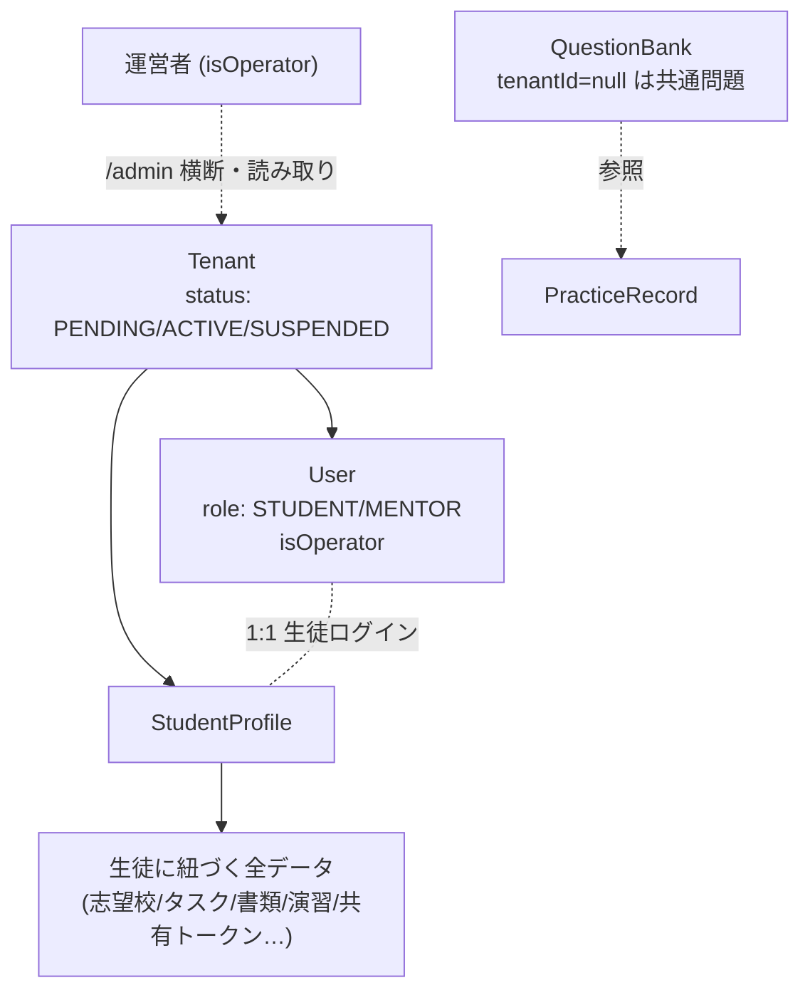
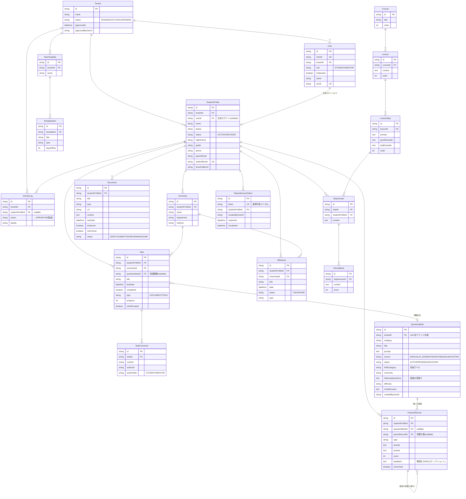

# DB設計図（現行スキーマ全体）

対象: compass-lms / DB: PostgreSQL (Neon) / 最終更新: 2026-07-19（マルチテナント化後）
※これは `prisma/schema.prisma` の現状を人間向けに図解したもの。正は常にschema.prisma。

## テナント分離の原則

すべての業務データは **Tenant → StudentProfile** の系統でテナントに属する。
アクセス制御は必ず認可ヘルパー（`assertMentor` / `assertStudentAccess` / `assertActiveTenant` / `assertOperator`）を通す。
`QuestionBank` だけは `tenantId = null` で「全テナント共通問題」を表現できる例外。

## 全体ER図

## モデル分類（役割別）

| グループ | モデル | 役割 |
|---|---|---|
| **テナンシー** | Tenant, User, StudentProfile | 塾・ログインアカウント・生徒。すべての分離の起点 |
| **指導管理** | University, Task, TaskComment, Milestone, Document | 志望校・タスク・面談コメント・日程・書類 |
| **テンプレート** | TaskTemplate, TemplateItem | タスクの雛形（塾ごと） |
| **演習・採点** | QuestionBank, PracticeRecord | 問題バンク（共通/塾別）と添削記録。Taskへ課題割当も |
| **共有** | SharedAccessToken | 保護者向け閲覧専用リンク |
| **監査** | ActivityLog | 操作履歴。運営者の横断アクセスも`action=OPERATOR`で記録 |
| **教材LMS** | Course, Lesson, LessonStep, StepAnswer, AIFeedback | ステップ式教材（テナント非依存の共通教材） |

## 設計上の注意（意図的な例外）

1. **`QuestionBank.tenantId = null`** … 運営提供の共通問題。全テナントから参照可（読み取りのみ）。
2. **`PracticeRecord.feedback` に構造化JSONを保存** … 採点基準を後から変えても過去の添削を当時のまま再現するためのスナップショット。検索・集計は独立カラム（score/type/questionBankId）で行う。
3. **`PracticeRecord.parentRecordId`** … 面接の深掘りチェーン（自己参照）。挑戦回数・問題バンク紐付けの集計からは除外。
4. **Course/Lesson系はテナント非依存** … 現状は全塾共通の教材。塾別に分けたくなったらtenantId追加（追加のみ）で対応可能。
5. **論理削除**（`isArchived` / `status=ARCHIVED`）を採用し、指導履歴・演習記録は物理削除しない。
6. **ID命名** … 業務データは接頭辞付き（`student-`/`task-`/`prac-`/`doc-`/`log-`/`univ-`等）で人が追える。QuestionBank/一部は`cuid()`。

## 今後テナント別に分けうる候補（現状は共通）

- Course/Lesson/LessonStep（塾ごとに独自教材を持たせる場合）
- 将来のAI利用計測テーブル（テナント別カウンタ・課金の土台。multi-tenant-plan.md P4）
