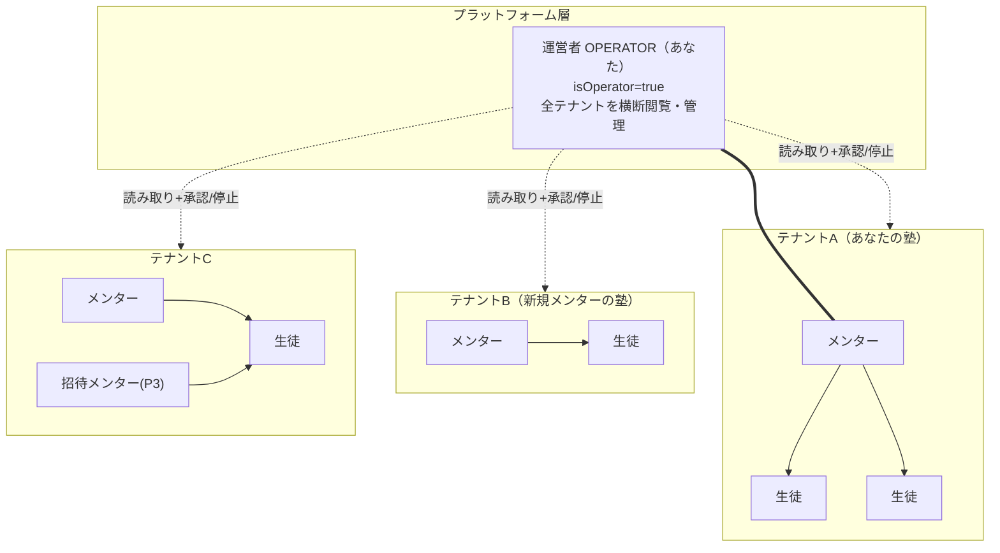
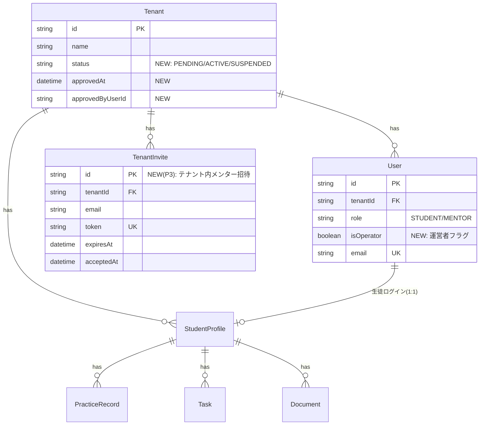
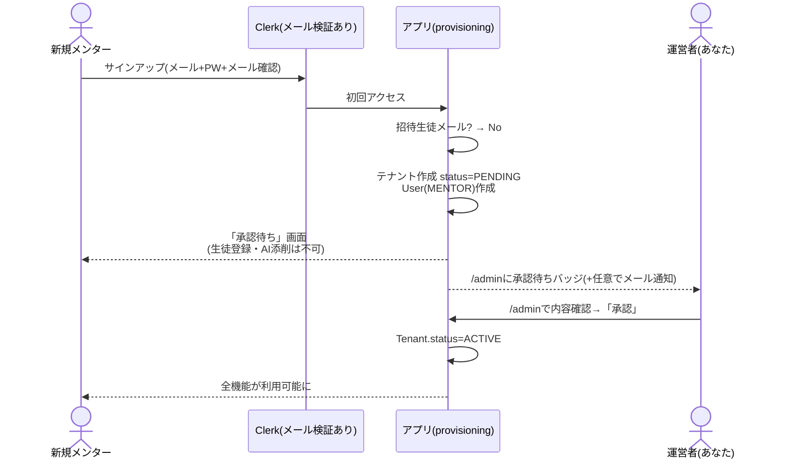
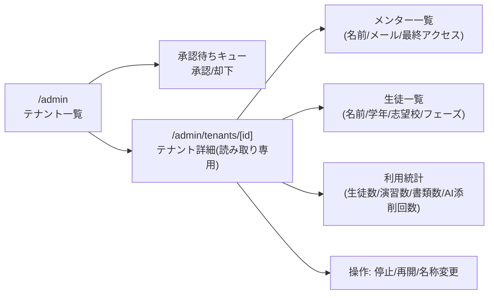

# マルチテナント化・運営者管理 計画書

作成日: 2026-07-18 / 対象: compass-lms

## 0. ゴールと現状のギャップ

**ゴール**
1. あなた以外の人がメンターとして新規登録し、独立した自分の塾（テナント）として利用できる
2. 運営者（あなた）は、全テナントのメンター・在籍生徒の情報を横断的に確認・管理できる
3. 上記を、テナント間のデータ分離を一切壊さずに実現する

**現状**
- テナント分離の骨格は実装済み（全データがtenantIdで分離、認可ヘルパーで検証済み）
- 未招待メールでのサインアップは既に「自分のワークスペース（テナント）付きメンター」を自動作成する
  → つまり **1のインフラは実質できている。欠けているのは「制御」と「可視性」**
- 運営者ロールが存在しない。あなたも一介のテナントメンターであり、他テナントは一切見えない
- テナントに状態がない（承認・停止の概念がない）。誰でも登録し放題で、あなたが気づく手段もない

## 1. 役割モデル（To-Be）



- **OPERATOR** は「ロール」ではなく **`User.isOperator` フラグ**として実装する。あなたは引き続き自分のテナントのMENTORでもある（両立）。
- 運営者の指定は **環境変数 `OPERATOR_EMAILS`**（カンマ区切り）で行い、該当メールのユーザーはアクセス時に自動で`isOperator=true`が付く。DB直編集不要・誤操作でも env が真実源。
- 運営者権限が効くのは **`/admin` 配下と専用アクションのみ**。既存のメンター/生徒ページの認可は一切変えない（分離を壊さないための最重要原則）。

## 2. データモデル変更（すべて追加のみ）



- `Tenant.status`: 既存テナント（あなたの塾）はマイグレーション時に`ACTIVE`で埋める。
- 監査: 運営者の閲覧・操作は既存の`ActivityLog`に `action: "OPERATOR_*"` として記録する（テーブル追加不要）。

## 3. 新規メンター登録フロー（承認制を推奨）



**設計判断（要あなたの承認）**: 登録直後を`PENDING`にする承認制を推奨します。理由は (a) 誰でもURLを踏めば塾を開設できてしまう現状の抑止、(b) AI添削はコスト（LLM API費）が発生するため、無審査開放はコスト攻撃に弱い。承認制が煩わしければ、env トグル `TENANT_AUTO_APPROVE=true` で即ACTIVEにも切替可能な作りにします。

- PENDING中のガード: メンターページは「承認待ちです」表示のみ。サーバーアクションは`assertActiveTenant`（新設）で拒否。
- SUSPENDED: 運営者が停止したテナントは全ユーザーがログイン後「停止中」画面へ。データは消さない。

## 4. 運営者コンソール `/admin`



- 一覧の各行: テナント名 / 状態 / メンター数 / 生徒数 / 直近30日のAI添削回数 / 最終活動日時
- **読み取り専用が原則**。生徒の答案本文・添削本文までは運営者にも表示しない（統計とプロフィールまで）。個別答案まで見る必要が出たら、その時に「テナント管理者の同意」を含めて別途設計する
- 運営者の全操作・閲覧はActivityLogへ記録（誰がいつどのテナントを見たか）
- アクセスガード: `isOperator`のみ。ページとアクション双方で検証

## 5. テナント内の複数メンター（P3）

「僕の塾に講師を追加する」ケース。生徒の招待（studentEmail）と同じ思想で:
- 設定画面から**メールアドレス指定でメンター招待**（TenantInvite作成・トークン付きURL送付 or 手動共有）
- 招待メールでサインアップ/ログイン → provisioning時にTenantInviteと照合 → 該当テナントのMENTORとして参加
- 未招待メールの自己登録（=新規テナント開設）とはフローが分岐するだけで両立する

```mermaid
flowchart TD
    S["サインアップ(メール検証済)"] --> Q1{生徒招待メール<br/>studentEmailに一致?}
    Q1 -- Yes --> ST["STUDENTとして該当テナントへ"]
    Q1 -- No --> Q2{メンター招待<br/>TenantInviteに一致?(P3)}
    Q2 -- Yes --> MI["既存テナントのMENTORとして参加"]
    Q2 -- No --> NT["新規テナント作成(PENDING)<br/>承認後に利用開始"]
```

## 6. セキュリティ不変条件（実装時に必ず守る）

1. テナント間のデータアクセスは、`isOperator` かつ `/admin` 専用アクション経由のみ。既存のクエリ・認可ヘルパーには手を入れない
2. 運営者バイパスは**読み取り専用**（例外はテナントの状態変更のみ）
3. `OPERATOR_EMAILS` はenvのみで管理。UIから運営者を任命する機能は作らない
4. 運営者の横断アクセスは全件監査ログに残す
5. 利用規約/プライバシーポリシーに「運営者が指導管理目的で登録情報・利用統計を閲覧できる」旨を明記する（法務上の宿題。**生徒=未成年の個人情報**を扱う自覚を持つ）

## 7. 実装フェーズと承認ゲート

| フェーズ | 内容 | マイグレーション | ゲート |
|---|---|---|---|
| P1 | `isOperator`/`Tenant.status`追加、OPERATOR_EMAILS シード、`/admin`一覧+詳細（読み取り専用）+統計 | 追加のみ2列 | 適用前確認 |
| P2 | 承認制フロー（PENDING画面・assertActiveTenant・承認/停止操作・監査ログ） | なし | 承認制でよいか |
| P3 | テナント内メンター招待（TenantInvite） | テーブル1つ追加 | - |
| P4 | AI利用の計測強化（テナント別のトークン/回数集計。将来の課金の土台） | テーブル1つ追加 | - |
| P5 | 課金（Stripe等）・プラン制限 | - | 別途計画 |

見積り: P1+P2で実装1セッション程度。P3も小さい。P4以降は必要になってから。

## 8. 未決事項（あなたの判断待ち）

1. **承認制（PENDING）を採るか、自動ACTIVEか**（推奨: 承認制）
2. 運営者が見られる範囲は「プロフィール+統計まで」でよいか（答案本文は不可視、の線引き）
3. `OPERATOR_EMAILS` に入れるメールアドレス（beee056@gmail.com を想定）
4. 新規テナントのAI添削に上限を設けるか（例: 承認後も月200回まで等。コスト保護。P4で本実装、P2で簡易カウンタだけ先行可能）
